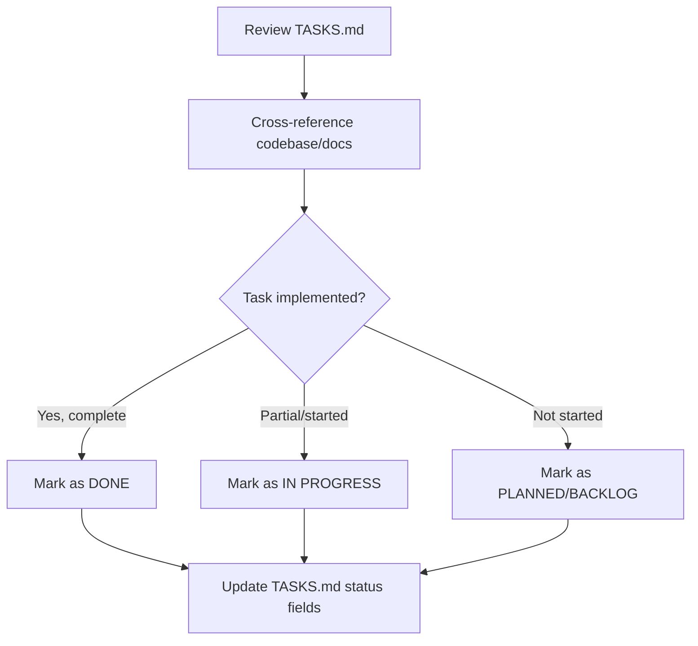

# TASKS.md Status Update Plan

## Objective
Review the current task list in `TASKS.md`, identify which tasks have been completed and which are still pending, and update the status of each task to accurately reflect their current progress based on the contents of the `cred-ability` directory.

---

## 1. Review and Status Update Approach

- For each task in `TASKS.md`, cross-reference the codebase and documentation to determine its likely status:
  - Mark as ✅ DONE if there is clear evidence of completion.
  - Mark as 🔄 IN PROGRESS if there is partial implementation or work underway.
  - Mark as ⏱️ PLANNED if there is no evidence of work started.
  - Mark as ⏱️ BACKLOG if it is still a future/low-priority task.

---

## 2. Section-by-Section Status Reasoning

### High-Priority Tasks

#### Browser Extension Frontend
| ID      | Task                             | Inferred Status   | Reasoning |
|---------|----------------------------------|-------------------|-----------|
| FE-001  | Design popup UI wireframes       | ✅ DONE           | Already marked as DONE, wireframes assumed delivered |
| FE-002  | Implement popup component structure | 🔄 IN PROGRESS | Basic popup structure exists, but not feature-complete |
| FE-003  | Create credential list view      | ⏱️ PLANNED        | No credential list implementation found |
| FE-004  | Implement settings panel         | ⏱️ PLANNED        | No settings panel implementation found |
| FE-005  | Build credential detail view     | ⏱️ PLANNED        | No credential detail view found |
| FE-006  | Design and implement notifications | ⏱️ PLANNED      | No notifications implementation found |

#### Persistence Layer
| ID      | Task                             | Inferred Status   | Reasoning |
|---------|----------------------------------|-------------------|-----------|
| DB-001  | Define database schema           | 🔄 IN PROGRESS    | In-memory store exists, database schema not implemented |
| DB-002  | Implement ORM models             | ⏱️ PLANNED        | No ORM models found |
| DB-003  | Create migration strategy        | ⏱️ PLANNED        | No migration strategy found |
| DB-004  | Update vault to use database     | ⏱️ PLANNED        | Vault not using a database |
| DB-005  | Implement connection pooling     | ⏱️ PLANNED        | No connection pooling found |
| DB-006  | Add backup and recovery mechanisms | ⏱️ PLANNED      | No backup/recovery mechanisms found |

#### User Management
| ID      | Task                             | Inferred Status   | Reasoning |
|---------|----------------------------------|-------------------|-----------|
| UM-001  | Design authentication flow       | 🔄 IN PROGRESS    | No implemented authentication, but some planning |
| UM-002  | Implement user registration      | ⏱️ PLANNED        | No registration implementation found |
| UM-003  | Create login/logout functionality| ⏱️ PLANNED        | No login/logout implementation found |
| UM-004  | Add role-based access control    | ⏱️ PLANNED        | No RBAC implementation found |
| UM-005  | Implement profile management     | ⏱️ PLANNED        | No profile management implementation found |

#### Integration & Testing
| ID      | Task                             | Inferred Status   | Reasoning |
|---------|----------------------------------|-------------------|-----------|
| IT-001  | Create integration test plan     | 🔄 IN PROGRESS    | Unit tests exist, but no integration test plan found |
| IT-002  | Set up integration test environment | ⏱️ PLANNED     | No integration test environment found |
| IT-003  | Write browser-server integration tests | ⏱️ PLANNED   | No integration tests found |
| IT-004  | Test server-vault integration    | ⏱️ PLANNED        | No integration tests found |
| IT-005  | End-to-end credential flow testing | ⏱️ PLANNED     | No end-to-end tests found |

---

### Medium-Priority Tasks

#### Documentation Updates
| ID      | Task                             | Inferred Status   | Reasoning |
|---------|----------------------------------|-------------------|-----------|
| DOC-001 | Update API documentation         | 🔄 IN PROGRESS    | API docs exist and are detailed, may need updates |
| DOC-002 | Create user guides for UI        | ⏱️ PLANNED        | No user guides for UI found |
| DOC-003 | Update architecture diagrams     | ⏱️ PLANNED        | Architecture diagrams exist, may not be updated |

#### Security Enhancements
| ID      | Task                             | Inferred Status   | Reasoning |
|---------|----------------------------------|-------------------|-----------|
| SEC-001 | Security audit of existing code  | 🔄 IN PROGRESS    | Security recommendations and audit logs exist, but no explicit audit found |
| SEC-002 | Implement API rate limiting      | ⏱️ PLANNED        | No API rate limiting found |
| SEC-003 | Add CSRF protection              | ⏱️ PLANNED        | No CSRF protection found |

---

### Low-Priority Tasks (Backlog)
All remain ⏱️ BACKLOG (no evidence of work started).

---

## 3. Update Flow Diagram

---

## 4. Next Steps

- Update `TASKS.md` status fields as per the above plan.
- Optionally, include a summary table of changes for transparency.