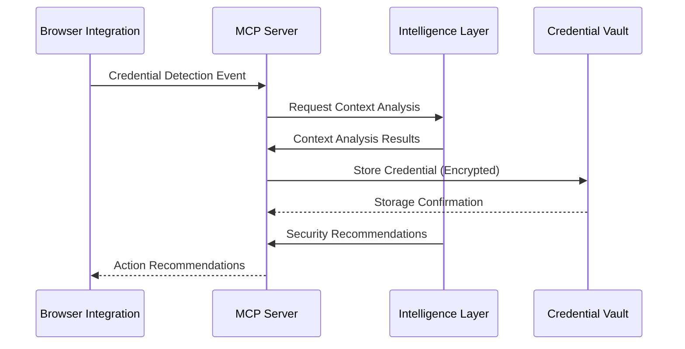
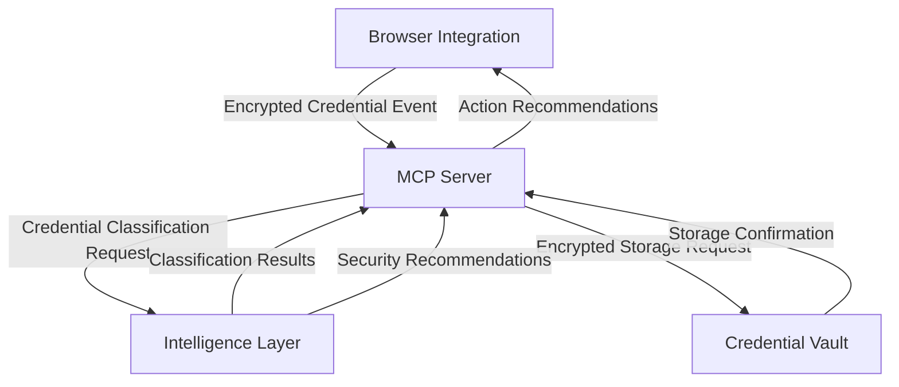

# CRED-ABILITY System Architecture

## System Overview

CRED-ABILITY is designed as a modular, secure system for credential management with four primary components working together to provide seamless credential detection, analysis, and protection.

## Core Components

### 1. Browser Integration Engine

The Browser Integration Engine is responsible for detecting, capturing, and contextualizing credentials across web applications.

#### Key Responsibilities:
- Real-time credential detection in web pages
- Form input monitoring and analysis
- Network request interception for credential identification
- Context capture for credential usage
- Secure transmission to MCP Server

#### Implementation Details:
- Browser extension architecture (Chrome, Firefox, Safari, Edge)
- Isolate detection patterns from core logic for maintainability
- Performance optimization for minimal browsing impact
- Content script and background script separation

#### Security Considerations:
- Isolated execution environment
- Minimal permission requirements
- No credential persistence in extension storage
- Encrypted communication with MCP Server

### 2. Model Context Protocol (MCP) Server

The MCP Server acts as the central coordination point for the CRED-ABILITY ecosystem, processing credential events and managing communication between components.

#### Key Responsibilities:
- Process credential detection events
- Coordinate credential classification and context analysis
- Bridge communication between system components
- Implement audit and compliance logging
- Manage authentication and authorization

#### Implementation Details:
- Node.js/Express.js RESTful API architecture
- WebSocket support for real-time communication
- Modular plugin system for extensibility
- Stateless design for horizontal scaling

#### Security Considerations:
- End-to-end encryption for all communications
- IP allowlisting and request validation
- Rate limiting and anomaly detection
- Comprehensive audit logging

### 3. Credential Vault

The Credential Vault provides secure storage and management of captured credentials with zero-knowledge architecture.

#### Key Responsibilities:
- Secure credential storage with encryption at rest
- Key management and derivation
- Access control and authorization
- Credential lifecycle management
- Backup and recovery mechanisms

#### Implementation Details:
- Encrypted database architecture
- Client-side encryption design
- Zero-knowledge proof authentication
- Hierarchical key management

#### Security Considerations:
- AES-256 encryption for credential data
- Argon2 for key derivation
- No plaintext credential storage
- Hardware security module (HSM) compatibility

### 4. Intelligence Layer

The Intelligence Layer provides context analysis, security recommendations, and intelligent credential management.

#### Key Responsibilities:
- Analyze credential context and relationships
- Generate security recommendations
- Identify potential vulnerabilities
- Create service mapping for credentials
- Recommend rotation and security strategies

#### Implementation Details:
- Modular analysis pipeline
- Context graph database for relationship mapping
- Rule-based recommendation engine
- Machine learning for pattern detection (future phase)

#### Security Considerations:
- Secured analysis pipeline
- Anonymized pattern analysis
- Isolated execution environment
- Access control for recommendation data

## Communication Flow

## Data Flow Architecture

## Security Architecture

CRED-ABILITY implements a defense-in-depth approach to security:

1. **Data in Transit**: TLS 1.3 with certificate pinning
2. **Data at Rest**: AES-256 encryption with secure key management
3. **Authentication**: Zero-knowledge proof and multi-factor authentication
4. **Authorization**: Role-based access control with least privilege principles
5. **Key Management**: Hierarchical key structure with client-side derivation
6. **Audit**: Comprehensive, tamper-evident audit logging

## Deployment Architecture

CRED-ABILITY is designed for flexible deployment options:

1. **Self-hosted**: Docker-based deployment with Kubernetes orchestration
2. **Cloud-native**: Microservices architecture for cloud platforms
3. **Hybrid**: Core components in trusted environment with distributed agents

## Extension Points

The system is designed with the following extension points:

1. **Detection Patterns**: Pluggable pattern modules for new credential types
2. **Integration Points**: Additional client integrations (IDE, CLI)
3. **Intelligence Modules**: Custom analysis and recommendation engines
4. **Compliance Modules**: Additional regulatory frameworks
