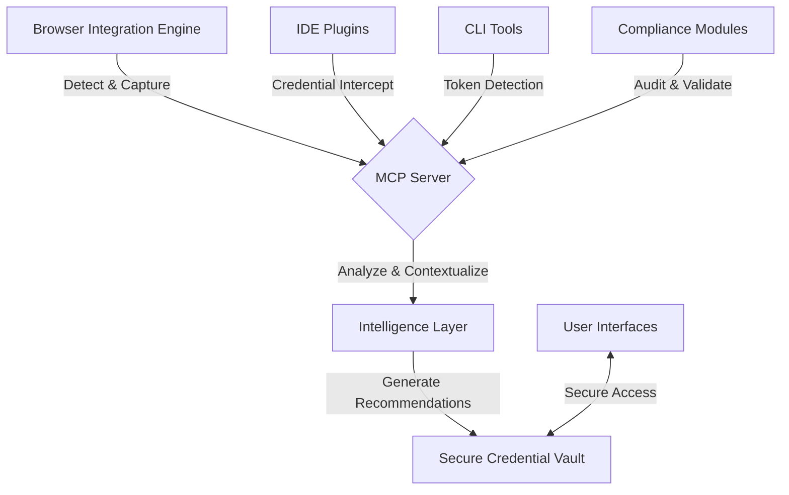

# CRED-ABILITY Project Planning

## Project Scope and Objectives

CRED-ABILITY is a credential management ecosystem designed to transform how digital identities and sensitive credentials are captured, managed, and secured across platforms.

### Primary Objectives

1. Develop a seamless credential capture system with browser integration
2. Create a secure credential vault with zero-knowledge architecture
3. Implement an intelligence layer for context analysis and security recommendations
4. Establish a Model Context Protocol (MCP) Server for unified communication
5. Provide a frictionless user experience with proactive security features

## System Architecture

## Technology Stack

### Frontend
- TypeScript
- React for management interfaces
- Browser Extension APIs (Chrome, Firefox, Safari)

### Backend
- Node.js with TypeScript
- Express.js for API services
- Jest for testing
- Docker for containerization

### Security
- AES-256 for encryption
- Argon2 for key derivation
- Zero-knowledge authentication mechanisms
- Role-based access control

### Data Management
- PostgreSQL for structured data
- Redis for caching and session management

## Timeline and Milestones

### Phase 1: Foundation (Weeks 1-4)
- [ ] Initial project setup and documentation
- [ ] Core architecture implementation
- [ ] Basic browser integration engine
- [ ] MCP server skeleton

### Phase 2: Core Functionality (Weeks 5-8)
- [ ] Credential detection and classification
- [ ] Secure credential vault implementation
- [ ] Basic intelligence layer functionality
- [ ] Integration between components

### Phase 3: Advanced Features (Weeks 9-12)
- [ ] Context analysis improvements
- [ ] Security recommendation engine
- [ ] Performance optimizations
- [ ] Multi-browser support

### Phase 4: Compliance and Deployment (Weeks 13-16)
- [ ] Compliance modules for GDPR, CCPA
- [ ] Audit trail implementation
- [ ] Final security review and hardening
- [ ] Deployment pipeline setup

## Key Performance Indicators

1. Credential detection accuracy > 95%
2. False positive rate < 1%
3. Capture latency < 50ms
4. System response time < 200ms
5. Security compliance with GDPR, CCPA, HIPAA, and SOC 2
